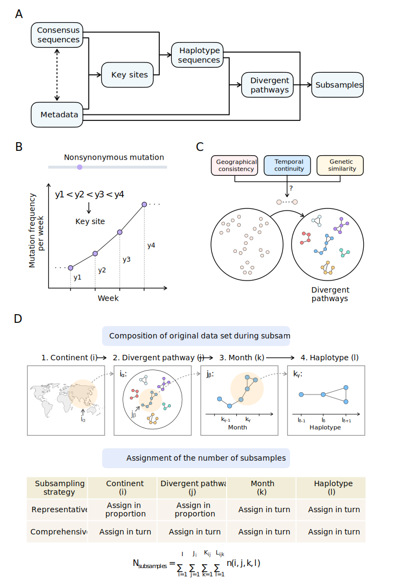

# covSampler

Phylogenetic analysis has been widely used to describe, display and infer the evolutionary patterns of viruses. The unprecedented accumulation of SARS-CoV-2 genomes has provided valuable materials for the real-time study of SARS-CoV-2 evolution. However, the large number of SARS-CoV-2 genome sequences also poses great challenges for data analysis.

Here, we developed a subsampling method named **covSampler** based on the spatiotemporal distribution and genetic variation of SARS-CoV-2 to reasonable and efficient subsampling the large-scale SARS-CoV-2 genome data sets.

## Overview

### Workflow (Figure A)

#### Determination of key genome sites of SARS-CoV-2 (Figure B)

- Genome sites of nonsynonymous mutations that increased in number of weekly emerging genomes for four consecutive weeks on at least one continent were defined as key sites.
- The haplotype sequence of each genome is constructed according to these key sites.

#### Construction of divergent pathways (Figure C)

- Divergent pathways in this paper are network-like results of viral clustering constructed by connecting each pair of viral sequences with geographic consistency `(from same administrative  division)`, temporal continuity `(collected <= 14 days apart)` and genetic similarity `(Hamming distance <= 1 between their haplotype sequences)`.
- Networks with only internal links --> divergent pathways
- Each divergent pathway reflects the local dynamic transmission and evolution of viruses over a period of time.

#### Representative and comprehensive subsampling based on the divergent pathways (Figure D)

- During subsampling, the composition of sequences in the original data set was divided into four levels:
  
    (1) All sequences in the original data set were divided by continent.

    (2) Sequences in each continent were divided into divergent pathways in the continent.

    (3) Sequences in each divergent pathway were divided by month.

    (4) Sequences in each month within divergent pathways were divided by haplotype.

- Then, each continent, divergent pathway, month and viral haplotype in the original data set was assigned an expected number of subsamples. Representative subsampling and comprehensive subsampling were performed using different strategies to assign the number of subsamples

## Usage
1. Run `covSampler/covSampler.py` to prepare the data for subsampling.
2. Run `covSampler/ncov_sampling.py` for subsampling.

## Acknowledgements
We sincerely thank the Global Intiative on Sharing All Influenza Data ([GISAID](https://www.gisaid.org/)) and all data contributors for making SARS-CoV-2 genomic sequence data available to the public and open science.